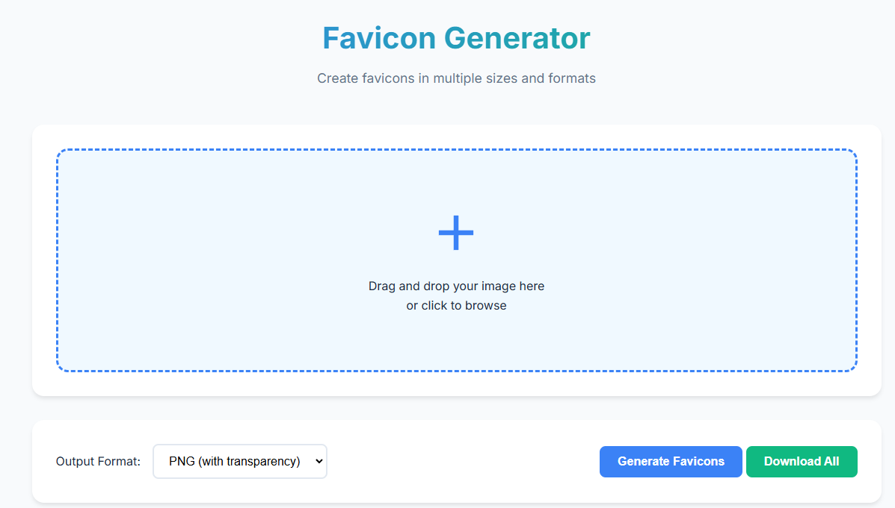

# Favicon Generator

A modern, free online tool to generate favicons in multiple formats (PNG, ICO, SVG) and sizes. Create professional favicons for your website with ease.



## 🚀 Features

- **Multiple Formats**: Generate favicons in PNG, ICO, and SVG formats
- **Various Sizes**: Create favicons in standard sizes (16x16 to 512x512)
- **Drag & Drop**: Easy-to-use drag and drop interface
- **Bulk Download**: Download all sizes at once in a ZIP file
- **Modern UI**: Clean, responsive design
- **Free & Open Source**: No registration required

## 🔧 Usage

1. **Upload Image**:
   - Drag and drop an image onto the upload area
   - Or click to select a file from your computer

2. **Choose Resize Mode**:
   - **Fit**: keeps the whole image (may add transparent padding)
   - **Fill**: fills the square (may crop)

3. **Download**:
   - Click any preview tile to download a PNG size
   - Use **Download PNGs (.zip)** for all PNG sizes
   - Use **Download Package** for a ready-to-install ZIP (ICO + key PNGs + `site.webmanifest` + `favicon.html` snippet)

## 💻 Development

### Project Structure

```
favicon-generator/
├── src/
│   ├── index.html
│   ├── css/
│   ├── js/
│   └── assets/
├── docker/
│   └── Dockerfile
├── docker-compose.yml
├── nginx.conf
└── README.md
```

### Requirements
- Modern web browser
- Docker (for containerized deployment)

### Run locally

- Docker: `docker compose up --build` then open `http://localhost:8080`
- No Docker: `python3 -m http.server --directory src 8000` then open `http://localhost:8000`

## 🔐 Security

- All processing is done client-side
- No images are uploaded to any server
- SSL/TLS encryption in production
- Secure HTTP headers configured

## 🌐 Browser Support

- Chrome (latest)
- Firefox (latest)
- Safari (latest)
- Edge (latest)
- Opera (latest)

## ⚡ Performance

- Optimized image processing
- Gzip compression enabled
- Static asset caching
- Lazy loading for previews

## 📝 License

This project is licensed under the MIT License - see the [LICENSE](LICENSE) file for details.

## 🤝 Contributing

1. Fork the repository
2. Create your feature branch (`git checkout -b feature/AmazingFeature`)
3. Commit your changes (`git commit -m 'Add some AmazingFeature'`)
4. Push to the branch (`git push origin feature/AmazingFeature`)
5. Open a Pull Request

## 🔍 SEO

- Optimized meta tags
- Structured data
- Sitemap included
- Mobile-friendly design

## 📦 Dependencies

No build-time dependencies; the app runs as static HTML/CSS/JS in the browser.

## 📞 Support

- Create an issue for bug reports
- Submit feature requests through issues
- Check existing issues before submitting new ones

## ✨ Acknowledgments

- Icons by [Your Icon Provider]
- Font: Inter by Google Fonts
- Inspired by [Your Inspiration]

## 🔄 Updates

Check the [CHANGELOG.md](CHANGELOG.md) for version history and updates.

---
Created with ❤️ by [Ulrich Raab](https://ulrichraab.eu)
